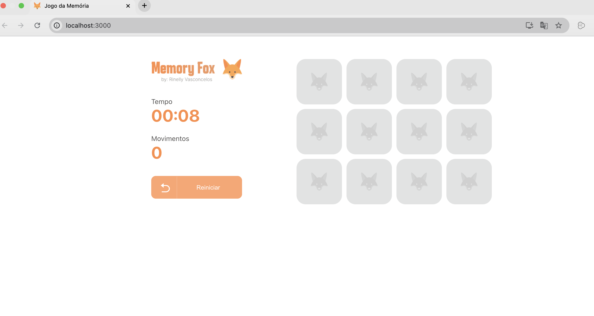
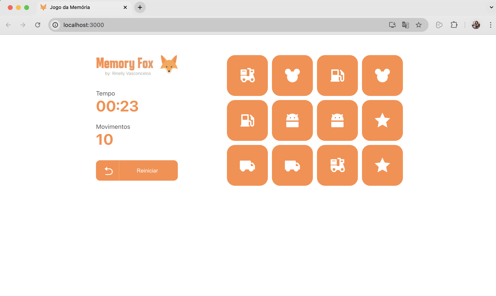

# 🧠 Jogo da Memória - React

Projeto desenvolvido com React e TypeScript que simula um jogo da memória com foco em lógica, design responsivo e desempenho.  
O objetivo é encontrar todos os pares de cartas no menor tempo e com o menor número de movimentos possível.


---

## 🚀 Funcionalidades

- Cartas com ícones personalizados  
- Cronômetro em tempo real  
- Contador de movimentos  
- Reconhecimento automático de pares  
- Exibição do tempo e número de movimentos ao final da partida
- Registro de recordes armazenado em `localStorage`  
- Design responsivo  

---

## 🛠️ Tecnologias Utilizadas

-   
-   
-   
-   
-   
- 

---

## 🧩 Como rodar o projeto localmente

1. Clone o repositório:

```bash
git clone https://github.com/seu-usuario/jogo-da-memoria-react
cd jogo-da-memoria-react
```

2. Instale as dependências:

```bash
npm install
```

3. Inicie o aplicativo:

```bash
npm start
```

> O aplicativo será iniciado em `http://localhost:3000`

---

## 📸 Imagens

Abaixo, alguns exemplos do jogo em execução:

### Tela Inicial


### Tela de Fim de Jogo


---

## 💡 Aprendizados

Durante este projeto, foram aplicados conhecimentos em:
- Criação de componentes reutilizáveis
- Gerenciamento de estado com `useState` e `useEffect`
- Lógica de jogo com tratamento de pares e delay
- Manipulação e formatação de tempo
- Persistência de dados com `localStorage`

---

## 👩‍💻 Desenvolvido por

**Rinelly Vasconcelos**

[](https://www.linkedin.com/in/seu-usuario)

---

## 📄 Licença

Este projeto está sob a licença MIT.  
Sinta-se à vontade para usar, estudar e compartilhar.
